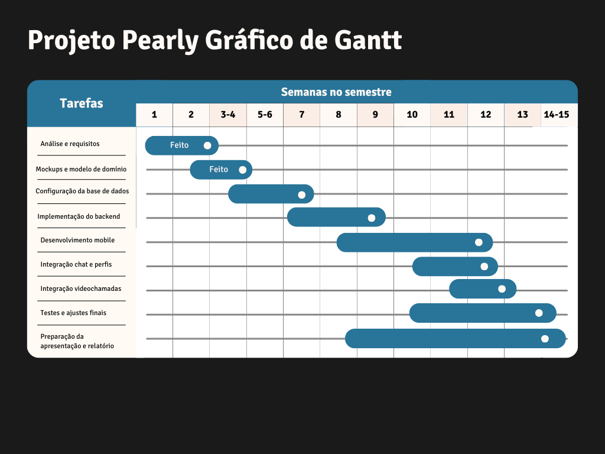

## Gráfico de Gantt

O gráfico de Gantt do projeto **Peerly** apresenta a distribuição temporal das principais tarefas ao longo do semestre.  
Este planeamento permite visualizar a sequência de atividades, a sobreposição de fases e os momentos críticos para garantir a entrega atempada do projeto.

